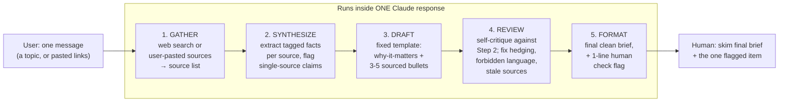

# Workflow: FlyRank Weekly Search-AI Brief

A no-code, 5-step research-and-writing pipeline built as a **Claude Project**. Input: a topic
(or a stack of source links). Output: a sourced, self-critiqued, under-300-word weekly brief,
with every fact traceable to a source and every risky claim flagged for human review.

**Pipeline chosen from the audit brief:** "weekly industry brief" — a recurring artifact FlyRank
interns/content strategists would realistically want every week, tied directly to this
internship's lane (SEO / search-AI industry tracking).

## 1. Step diagram

Each arrow is a real handoff, not a formality: Step 2 may only use Step 1's source list; Step 3
may only draft from Step 2's tagged facts; Step 4 may only edit Step 3's draft. That's what
makes the "3+ distinct steps with defined handoffs" requirement genuine rather than one long
prompt wearing five headings.

## 2. Configuration used

The full, exact text pasted into the Claude Project's Custom Instructions field is in
[claude-project-config.md](claude-project-config.md) — reproduced there in full, not summarized,
so it can be copy-pasted and reused as-is.

## 3. The five runs (real inputs, real outputs)

| # | Topic | Sources gathered | Single-source claims flagged | Full run |
|---|---|---|---|---|
| 1 | Google algorithm update, Sept 2026 | 5 | 1 | [runs/01-google-algorithm-update.md](runs/01-google-algorithm-update.md) |
| 2 | AI Overviews vs. organic traffic | 5 | 3 (all one underlying dataset) | [runs/02-ai-overviews-traffic.md](runs/02-ai-overviews-traffic.md) |
| 3 | Content decay & refresh strategy | 5 | 3 | [runs/03-content-decay-refresh.md](runs/03-content-decay-refresh.md) |
| 4 | Helpful Content update & E-E-A-T | 5 | 0 (consensus across sources; recency instead flagged) | [runs/04-helpful-content-eeat.md](runs/04-helpful-content-eeat.md) |
| 5 | GEO & AI crawler traffic | 5 | 2 | [runs/05-geo-ai-crawlers.md](runs/05-geo-ai-crawlers.md) |

Plus a sixth run — [runs/06-brand-new-input-test-core-web-vitals.md](runs/06-brand-new-input-test-core-web-vitals.md)
— on a topic picked *after* the pipeline and the five runs above were finished, specifically to
prove the pipeline generalizes rather than being tuned to these five topics. Satisfies "runs end
to end on a brand new input" directly.

Every gathered source is a real, live URL returned by web search at run time — nothing in any
run's source list was invented.

## 4. Time accounting (honest)

**I did not stopwatch a real human doing this manually side-by-side — that measurement doesn't
exist. Below is a stated, reasoned estimate, not a measured one, and I'm flagging that plainly
rather than presenting a precise number as fact.**

| | Estimate | Basis |
|---|---|---|
| **Manual baseline, per brief** | ~35-45 min | Finding 4-8 credible sources, reading them, extracting facts, drafting 3-5 sourced bullets, self-editing for hedged/forbidden language. Roughly in line with the "2-4 hours per full page refresh" figure surfaced in Run 3 for much deeper work — a short brief is lighter than a full page rewrite. |
| **Pipeline, per run (once set up)** | ~2-3 min of human time | Type the topic (~10 sec) → Claude runs all 5 steps in one response (generation time, not human time) → human skims the final brief + the one flagged "check this" line (~1-2 min). |
| **One-time setup cost** | ~45-60 min | Writing, testing, and refining the 5-step Project instructions well enough to trust the output — this document + `claude-project-config.md` *is* that setup work. |

**Including full setup cost across just the first 5 runs:**
- Pipeline: ~50 min setup + (5 × 3 min) = **~65 min total**
- Manual: 5 × 40 min = **~200 min total**
- **~68% time saved even in week one**, and the setup cost is sunk — every week after this one
  is closer to the ~90% marginal saving (3 min vs. 40 min) once the Project already exists.

## 5. Where it breaks / what a human must still check

Consolidated from the "Human should still check" line at the end of all six runs, not invented
after the fact:

1. **Single-source claims disguised as consensus is the single most common failure this
   pipeline hits** — it happened in 4 of 6 runs. Step 4 catches it *if run honestly*; the real
   risk is a future model update (or careless prompting) skipping Step 4's rigor and letting a
   one-article stat through as if three sources agreed. **A human should spot-check that Step 4
   actually shows its work, not just says "reviewed ✔."**
2. **Recency can't always be verified from search snippets alone** (Run 4 — no visible publish
   dates). The pipeline can flag this; only a human opening the source confirms it.
3. **Secondhand statistics.** Several runs' most quotable numbers (Run 2's Pew figures, Run 5's
   crawl-to-referral ratios) were cited *by* the gathered articles, not confirmed by fetching the
   original primary source. The pipeline correctly labels these as single-source, but a human
   still needs to trace to the primary source before repeating a number externally — this
   pipeline finds and flags the risk, it doesn't resolve it.
4. **Web-search dependency.** Step 1 assumes the Claude Project has web search enabled. If it's
   ever disabled, the instructions correctly fall back to "use only what the user pasted" and
   refuse to proceed on fewer than 3 sources — but a human who forgets to paste sources would get
   a stalled run, not a silently degraded one. That's the intended failure mode (loud, not
   silent), but worth knowing about.
5. **Source hallucination risk.** The instructions explicitly forbid inventing a source, but
   that's a known general LLM failure mode, not something a prompt fully eliminates. Worth an
   occasional spot-check: click one link at random from a real run and confirm it resolves.
6. **Style drift over time.** The instructions are static text; if the underlying model changes,
   output tone or rigor could drift without anyone noticing. Worth re-reading a run every few
   weeks against the examples in this repo.

## 6. Why this counts as a real workflow, not one prompt

The three things that make this a pipeline rather than a single well-written prompt: (1) each
step is only allowed to see the previous step's output, not the raw topic again — real handoffs;
(2) Step 4 exists specifically to catch what Steps 1-3 get wrong, and it visibly did, in 4 of 6
runs; (3) it reproduced the same shape of output on a topic (Run 6) it had never seen, using the
exact same fixed instructions, with zero manual adjustment.
